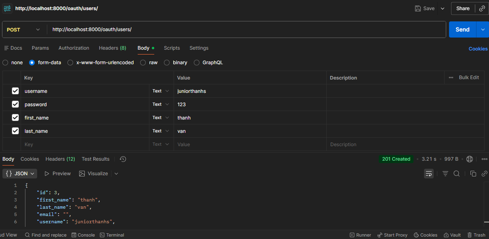
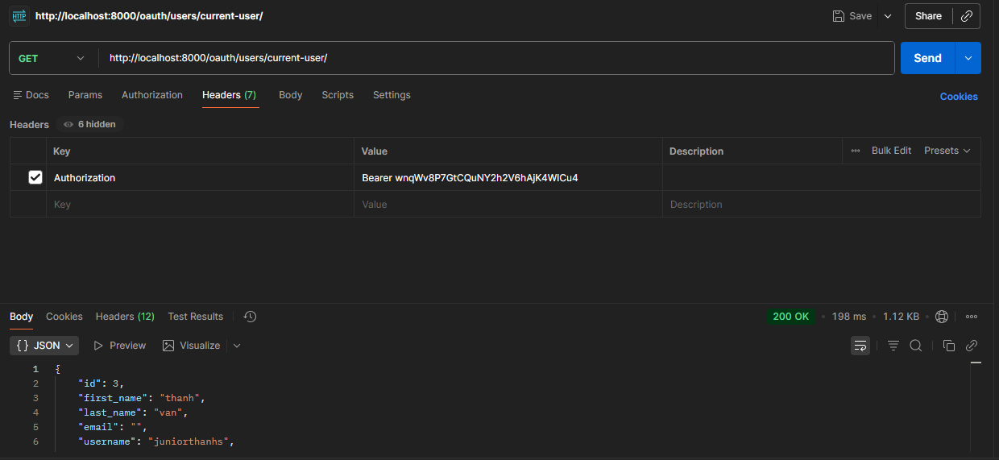
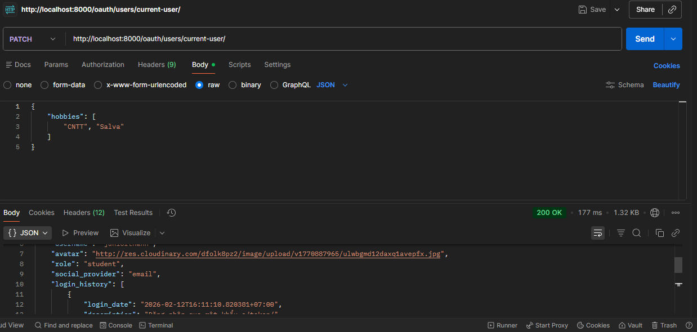
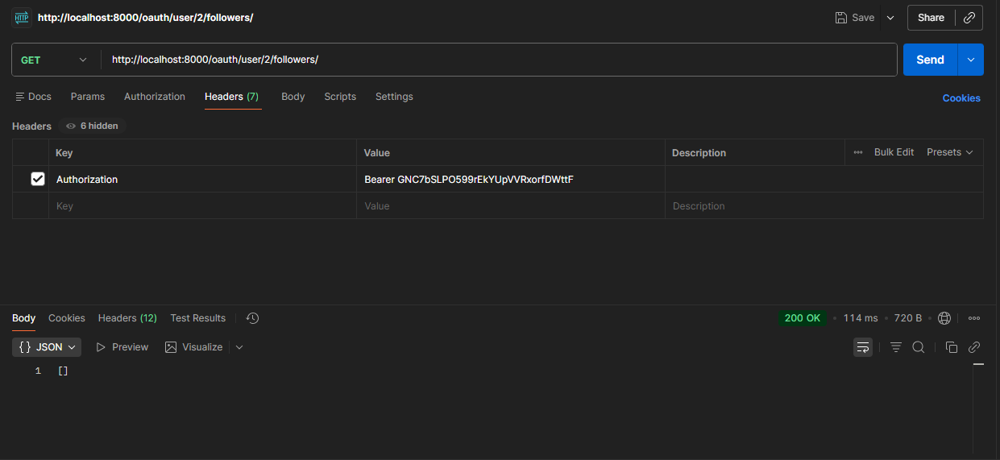
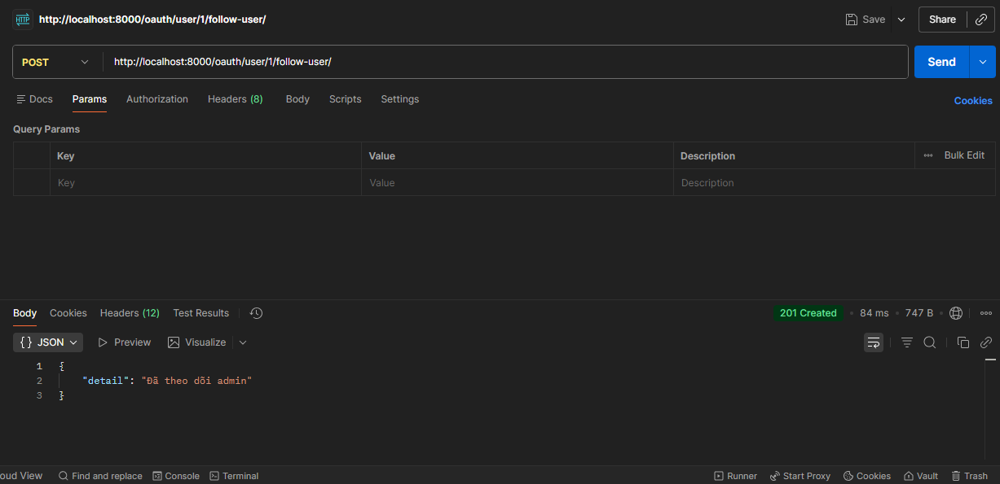
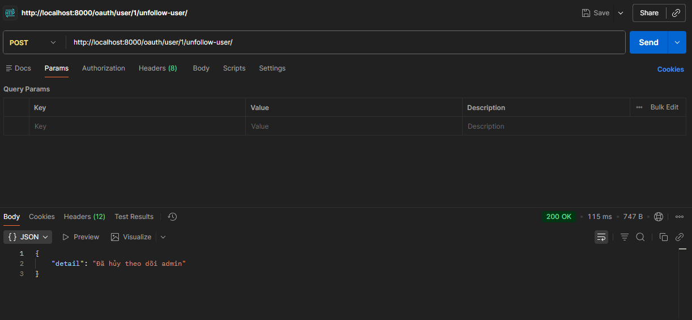

# OUEL - Open University English Learning
## API Người dùng
| API  | Input  | Output | Use case |
|------|--------|---------|---------|
| (POST) http://localhost:8000/oauth/users/ | username, password, first_name, last_name, avatar | Thông tin người dùng bao gồm profile | Dùng khi cần đăng ký tài khoản |
| (POST) http://localhost:8000/o/token/ | client_id, client_secret, username, password, grant_type | Thông tin token của người dùng | Dùng khi cần đăng nhập tài khoản |
| (GET) http://localhost:8000/oauth/users/current-user/ | Bearer token | Thông tin đầy đủ của người dùng bao gồm profile và follower | Dùng khi cần xem thông tin người dùng |
| (PATCH) http://localhost:8000/oauth/users/current-user/ | first_name, last_name, avatar, email, profile | Thông tin đã chỉnh sửa của người dùng bao gồm profile | Dùng khi cần chỉnh sửa hồ sơ người dùng |
| (GET) http://localhost:8000/oauth/user/{id}/followers/ | Bearer token của người dùng hiện tại | Thông tin follower của người có {id} | Dùng khi cần xem danh sách các follower của người {id} |
| (GET) http://localhost:8000/oauth/user/{id}/following/ | Bearer token của người dùng hiện tại | Thông tin following của người có {id} | Dùng khi cần xem danh sách các following của người {id} |
| (POST) http://localhost:8000/oauth/user/{id}/follow-user/ | Bearer token của người dùng hiện tại | Đăng ký follow người {id} | Dùng khi cần đăng ký tới người {id} |
| (POST) http://localhost:8000/oauth/user/{id}/unfollow-user/ | Bearer token của người dùng hiện tại | Hủy đăng ký follow người {id} | Dùng khi cần hủy đăng ký following của người {id} |

